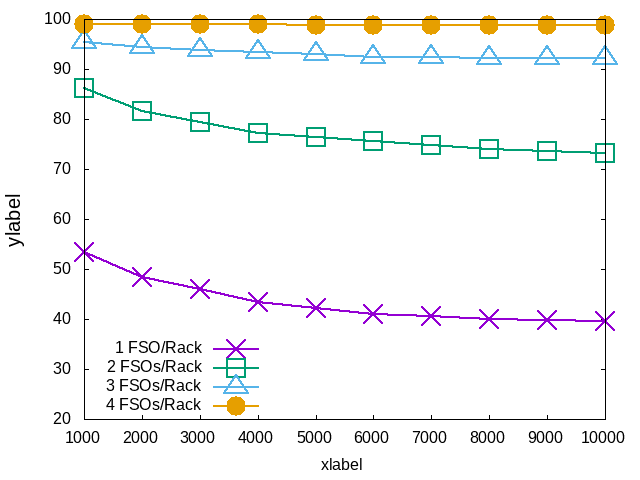
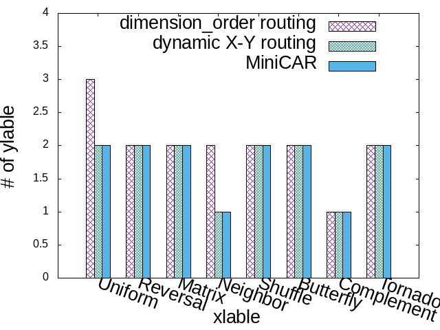
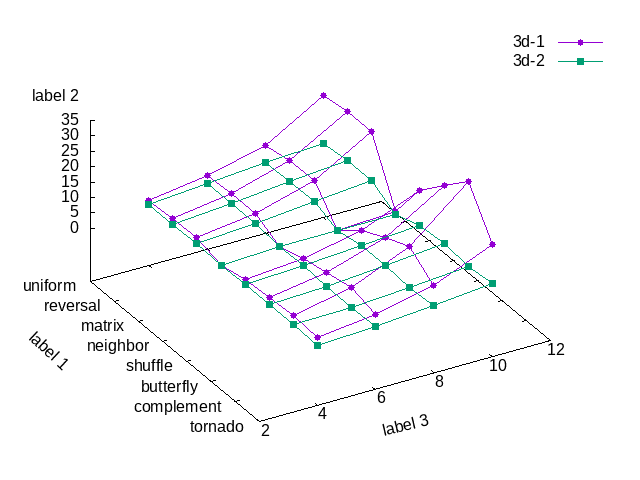
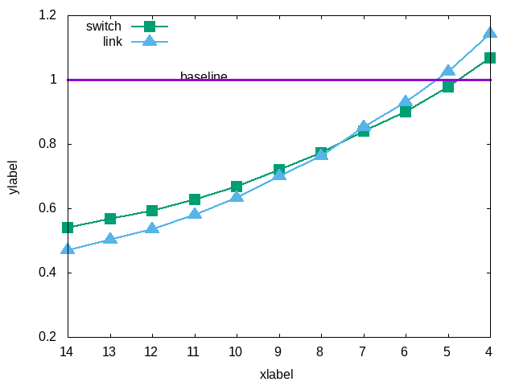
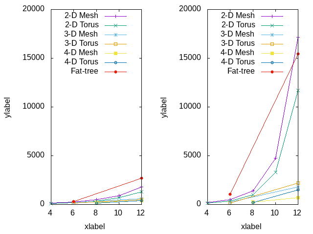
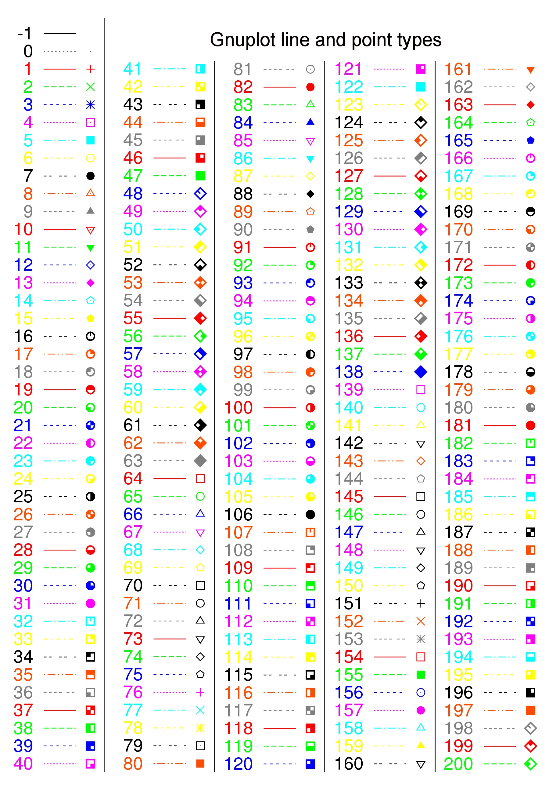
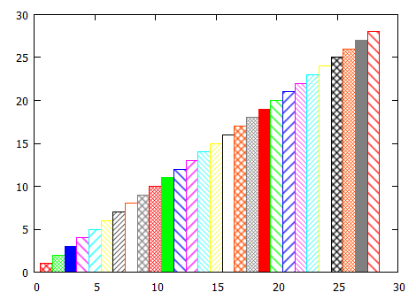

# plot
This repo plots various graphs.

## gnuplot

### Usage

* mac
```shell
$ cd ~/Documents/GitHub/plot/gnuplot # where .gnuplot and data files (e.g., .txt) exist so that relative path can be used in .gnuplot
$ gnuplot -e "load 'xxx.gnuplot'" 
```

* linux
```shell
$ cd /github/plot/gnuplot # where .gnuplot and data files (e.g., .txt) exist so that relative path can be used in .gnuplot
$ gnuplot -e "load 'xxx.gnuplot'" 
```

* win10
```shell
# enter gnuplot environment 
> cd "C:/Users/PC/Documents/GitHub/plot/gnuplot" # # where .gnuplot and data files (e.g., .txt) exist so that relative path can be used in .gnuplot; do not forget " "
> load 'xxx.gnuplot' 
```

### Examples

* [curve.gnuplot](gnuplot/curve.gnuplot)
<div align=center>

</div>

* [histograms.gnuplot](gnuplot/histograms.gnuplot)
<div align=center>

</div>

* [3d.gnuplot](gnuplot/3d.gnuplot)
<div align=center>

</div>

* [horizon.gnuplot](gnuplot/horizon.gnuplot)
<div align=center>

</div>

* [multiplot.gnuplot](gnuplot/multiplot.gnuplot)
<div align=center>

</div>

### Misc
* line-point
<div align=center>

</div>
* fill-pattern
<div align=center>

</div>
